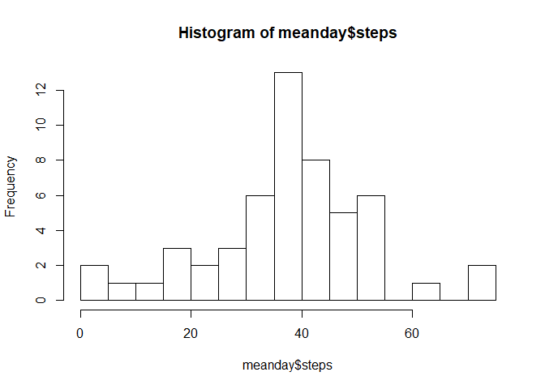
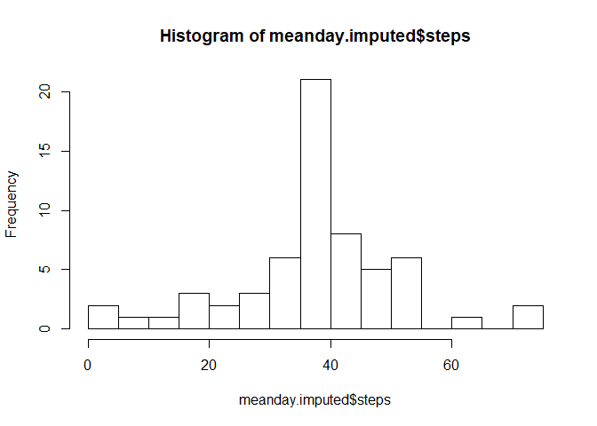
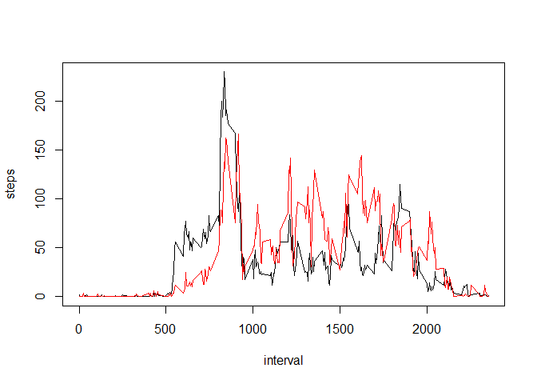

## **Reproducible Research: Course Project 1**

### Loading and preprocessing the data

Loading data

```r
activity <- read.csv("activity.csv")
head(activity)
```

```
##   steps       date interval
## 1    NA 2012-10-01        0
## 2    NA 2012-10-01        5
## 3    NA 2012-10-01       10
## 4    NA 2012-10-01       15
## 5    NA 2012-10-01       20
## 6    NA 2012-10-01       25
```

Convert date into date format

```r
activity$date <- as.Date(activity$date)
```

### What is mean total number of steps taken per day?

Calculate mean per day

```r
meanday <- aggregate(steps ~ date, data = activity, mean)
head(meanday)
```

```
##         date    steps
## 1 2012-10-02  0.43750
## 2 2012-10-03 39.41667
## 3 2012-10-04 42.06944
## 4 2012-10-05 46.15972
## 5 2012-10-06 53.54167
## 6 2012-10-07 38.24653
```

print hist, mean and median for mean steps per day

```r
hist(meanday$steps,breaks = 20)
```

<!-- -->

```r
mean(meanday$steps,na.rm=TRUE)
```

```
## [1] 37.3826
```

```r
median(meanday$steps,na.rm=TRUE)
```

```
## [1] 37.37847
```

### What is the average daily activity pattern?

Calculate mean per interval and make a plot of average activity

```r
meanperiod <- aggregate(steps ~ interval, data=activity, mean)
head(meanperiod)
```

```
##   interval     steps
## 1        0 1.7169811
## 2        5 0.3396226
## 3       10 0.1320755
## 4       15 0.1509434
## 5       20 0.0754717
## 6       25 2.0943396
```

```r
plot(steps ~ interval, type = "l", data=meanperiod)
```

<!-- -->

5-minutes interval with max number of steps

```r
meanperiod[meanperiod$steps==max(meanperiod$steps, na.rm=TRUE),1]
```

```
## [1] 835
```

### Imputing missing values

How many NA's:

```r
sum(is.na(activity$steps))
```

```
## [1] 2304
```

```r
sum(is.na(activity$steps))/length(activity$steps)
```

```
## [1] 0.1311475
```

Filling NA's with average for an interval across all days

```r
activity.imputed <- activity
for (i in 1:nrow(activity.imputed)){
    if (is.na(activity.imputed$steps[i])){
        intrvl <- activity.imputed$interval[i]
        activity.imputed$steps[i]<-meanperiod[meanperiod$interval==intrvl,2]
    }
}
sum(is.na(activity.imputed$steps))
```

```
## [1] 0
```

print hist, mean and median for mean steps per day on imputed dataset

```r
meanday.imputed <- aggregate(steps ~ date, data = activity.imputed, mean)
hist(meanday.imputed$steps,breaks = 20)
```

<!-- -->

```r
mean(meanday.imputed$steps)
```

```
## [1] 37.3826
```

```r
median(meanday.imputed$steps)
```

```
## [1] 37.3826
```

### Are there differences in activity patterns between weekdays and weekends?

Make a vector of weekdays and weekends

```r
activity.imputed$weekdays<-weekdays(activity.imputed$date,abbreviate = TRUE)
activity.imputed$weekdays[activity.imputed$weekdays == "Сб" | activity.imputed$weekdays == "Вс"] <- "WE"
activity.imputed$weekdays[activity.imputed$weekdays != "WE"] <- "WD"
```

Make a plot comparing average activity at weekdays and weekends

```r
meanperiod.imputed.wd <- aggregate(steps ~ interval, data = activity.imputed[activity.imputed$weekdays=="WD",], mean)
meanperiod.imputed.we <- aggregate(steps ~ interval, data = activity.imputed[activity.imputed$weekdays=="WE",], mean)
with(meanperiod.imputed.wd, plot(interval, steps, type="l"))
with(meanperiod.imputed.we, lines(interval, steps, col = "red"))
```

<!-- -->
